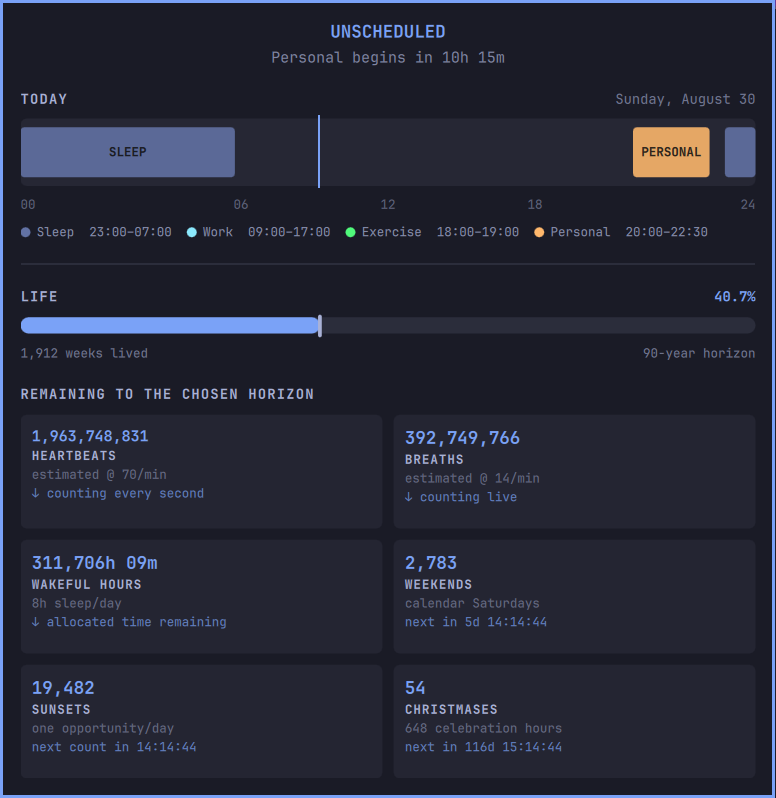

# From Time to Time

This plugin began with the idea of having small and no-friction reminder of where I was in the day, since as a freelancer it is easy to drift away most common routines like working hours, exercise and sleep...and I guess that most of us are or have been there
The plugin keeps those periods visible on the bar and can play a short chime when one starts or ends, it simply helps to keep me accountable

The second part came after seeing DHH's life-progress bar
I set too the horizon to 90 years and realized I was already a little past halfway through it...that caught me quite off guard and I began wondering not only how much time might be left but how many times I might still be able to do some ordinary things or interests that are important to me

So I've created a collection of optional cards for recurring activities, relationships and events
Their numbers are just rough estimates but the point is to generate some awareness in the volatility of life and perhaps the realization of not taking everything for granted




## Features

- Compact current-period label, progress, and remaining time
- Full 24-hour schedule with overnight and weekday-aware periods
- Compact life-horizon progress bar
- Perspective mode: one context-aware reflection drawn from Saturdays, sunsets, Christmases, and the weekly life rollover
- Cards mode: a two-column deck with both fixed and rotating metrics cards
- Optional start/end sounds with quiet hours
- Startup, suspend/resume and multi-monitor alert safeguards
- Local JSON configuration

## Requirements

- Omarchy Quattro with the Quickshell-based Omarchy shell
- `bash`, `flock`, and `pw-play` for transition alerts
- Freedesktop sound files for the default cues or custom readable sound paths


## Install

```sh
omarchy plugin add https://github.com/Deca/omarchy-from-time-to-time.git --enable
omarchy bar move io.github.deca.from-time-to-time --section center
```

Create a personal configuration without overwriting an existing one:

```sh
install -Dm600 -n \
  "$HOME/.config/omarchy/plugins/io.github.deca.from-time-to-time/timeline.example.json" \
  "$HOME/.config/omarchy/timeline.json"
```

Then edit:

```text
~/.config/omarchy/timeline.json
```

Changes are loaded automatically. Without a personal configuration the plugin remains usable in an empty state and displays setup guidance

## Configure

Set `life.birthDate` to an ISO local date:

```json
{
  "life": {
    "enabled": true,
    "birthDate": "1990-01-01",
    "horizonYears": 90
  }
}
```

The complete sanitized schema is in [`timeline.example.json`](timeline.example.json). since is strict JSON so i've put explanatory notes  in  `_note`

### Schedule periods

```json
{
  "id": "work",
  "label": "Work",
  "start": "09:00",
  "end": "17:00",
  "color": "#8be9fd",
  "days": ["mon", "tue", "wed", "thu", "fri"]
}
```

A period ending before it starts crosses midnight. `days` identifies the day on which the period starts. Supported names are `sun`, `mon`, `tue`, `wed`, `thu`, `fri`, and `sat`.

Schedule entries should not overlap, but if they do the later entry wins the compact current-period view while both remain visible in the timeline

### Transition alerts

Global alerts are configured under `alerts`:

```json
{
  "alerts": {
    "enabled": true,
    "quietHours": {
      "enabled": true,
      "start": "22:00",
      "end": "07:00"
    },
    "startSound": "/usr/share/sounds/freedesktop/stereo/service-login.oga",
    "endSound": "/usr/share/sounds/freedesktop/stereo/complete.oga"
  }
}
```

St `"sound": false` on an individual period or give it `startSound` and `endSound` overrides

Alerts suppress cues on startup and configuration reload, stale cues after suspend or clock jumps and duplicate playback from multiple monitors

### Visualization modes

Perspective mode is the default
It chooses one featured reflection rather than presenting a dashboard of equally weighted counters. Context decides what deserves prominence: Christmas Day, the start of a personal life-week, Saturday, and local evening can each change the copy.

Set `visualization.mode` to `cards` for a configurable deck:

```json
{
  "visualization": {
    "mode": "cards",
    "cards": {
      "count": 6,
      "fixed": ["lifeWeek", "weekends", "sunsets", "christmas"]
    }
  }
}
```

`count` accepts any positive whole number. Fixed IDs keep their listed order. Enabled card metrics not fixed form the rotation pool; enough are selected without replacement each time the panel opens and remain in place while it is open. Rotating cards have an accent tint so they are visibly distinct from neutral fixed cards. If too few metrics are available, the panel shows fewer cards rather than duplicates or filler.

The default card set is `lifeWeek`, `weekends`, `sunsets`, `christmas`, `heartbeats`, `breaths`, `wakefulHours`, and `familyMeals`; [`CARDS.md`](CARDS.md) documents the optional finite-window cards. Cards include a small live countdown to the next meaningful estimate or calendar change. Fast-changing estimates such as heartbeats and breaths count down in their own units instead of seconds. Rate-based values are estimates to a chosen horizon, not medical predictions. `familyMeals` is disabled in the example because it describes a personal relationship; enable it only when its assumptions feel useful. `astronomicalEvents` selects the nearest future event from a static local list; it does not calculate, fetch, or update event dates.

#### Managing cards

Each card has an `enabled` switch under `metrics`. Disabled cards will not be fixed or selected for rotation
`visualization.cards.fixed` are those cards that will appear first and do not rotate
Every other enabled card is a candidate for the remaining random slots.
You change the list to choose a different balance, for example:

```json
{
  "visualization": {
    "mode": "cards",
    "cards": {
      "count": 4,
      "fixed": ["lifeWeek", "familyMeals"]
    }
  },
  "metrics": {
    "familyMeals": {
      "enabled": true,
      "timesPerWeek": 3,
      "untilDate": "2030-01-01"
    }
  }
}
```

Every metric also accepts optional `label` and `reflection` strings, to override the card default text. Empty values retain the built-in wording
Keep personal copy in `~/.config/omarchy/timeline.json` rather than editing `Model.js`. See [`CARDS.md`](CARDS.md#personalizing-card-copy) for further examples

Changes reload automatically, reopen the panel after changing configuration or press `R` while focused / middle-click the bar to reload.
A bad mode, non-positive or fractional card count, unknown ID, disabled fixed ID, duplicate or excess fixed ID is ignored and shown as a configuration issue in the panel
If fewer enabled cards exist than requested slots then fewer cards are shown

[`METRICS.md`](METRICS.md) remains a research catalogue and admission test for future ideas—not a menu of promised features.

## Interactions
- Left click: open or close the panel
- Middle click: reload configuration
- Escape: close the panel
- `R` while the panel is focused: reload configuration

The panel can also be controlled through the shell:

```sh
omarchy-shell shell summon io.github.deca.from-time-to-time '{}'
omarchy-shell shell hide io.github.deca.from-time-to-time
```

## Remove

```sh
omarchy plugin remove io.github.deca.from-time-to-time
```

Removal intentionally leaves your personal configuration in place. Delete it separately only if you no longer want it:

```sh
rm "$HOME/.config/omarchy/timeline.json"
```

## Development

```sh
omarchy plugin validate .
node tests/model.test.js
tests/alerts.test.sh
```

## License

[MIT](LICENSE). Portions follow Omarchy's MIT-licensed clock/bar-widget structure; the original copyright notice is preserved.
